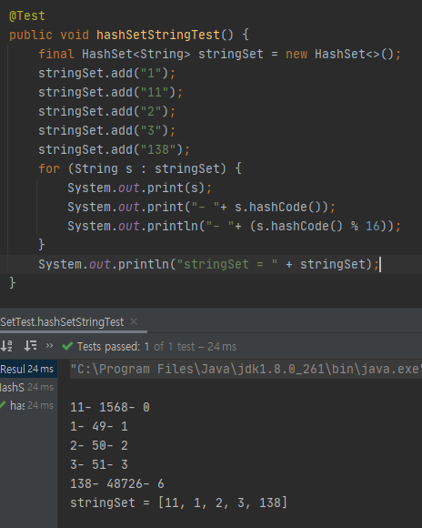

### 2021-03-09

## 상태 패턴
- 참고: https://victorydntmd.tistory.com/294

- __정의__
    - 기능이 상태에 따라 다르게 동작해야 할 때 사용하는 패턴
    - 상태를 별도의 타입으로 분리하고, 각 상태별로 알맞은 하위 타입을 구현

- __특징 및 장점__
    - 상태 객체가 기능을 제공한다
        - 인터페이스로 필요한 기능을 추상화 시켜두고, 구체적인 상태 클래스를 통해 기능을 구체화 시킨다
        - 직접 상태를 체크하여 상태에 따라 행위를 호출하는 것이 아닌,
        - 상태를 객체화 하여 상태 객체가 행동을 할 수 있도록 위임한다.
    - 상태가 많아질 경우...
        - 조건문: 코드가 복잡해져서 유지보수가 어려움
        - 상태 패턴: 클래스의 갯수는 증가하지만 코드의 복잡도는 그대로!
    - 관련된 코드가 한 곳에 모여있기 때문에, 안전하고 빠른 코드 수정 가능!

- __예시 코드__
    - Laptop의 전원 버튼을 눌러보자!
        - 현재 상태에 따라 행동을 다르게 정의해 주는 구조가 아니라! (if-else 주구장창)
        - 수행해야 할 행동을 interface로 추상화 해주고,
        - Laptop이 가능한 상태를 나타내는 여러 클래스를 정의해준 다음에,
        - Laptop에 해당 행동에 대한 요구가 들어왔다면, 현재 상태에게 해당 행동을 위임해준다!
``` Java
public class Laptop {
    private State state;

    public Laptop() {
        this.state = new Off();
    }

    public void pushPower() {
        state = state.pushPower();
    }

    public State getState() {
        return this.state;
    }
}

public interface State {
    State pushPower();
}

public class Off implements State {
    @Override
    public State pushPower() {
        return new PowerSaving();
    }
}

public class PowerSaving implements State{
    @Override
    public State pushPower() {
        return new On();
    }
}

public class On implements State {
    @Override
    public State pushPower() {
        return new Off();
    }
}
```

## HashSet vs TreeSet vs LinkedHashSet
- __Hashset은?__
    - 중복된 원소를 허용하지 않는 Set
    - 순서도 고려되지 않음
    - iterator을 통해 집합안의 원소를 탐색할 수 있음
        - hasNext(): 다음 원소가 남아있는지 boolean 값 반환
        - next(): 다음 원소를 가져옴
        - remove(): 현재 반복자가 가리키고 있는 원소 삭제
        
- __HashSet은 왜 같은 순서로 출력하는가?__
    - HashSet은 순서를 고려하지 않고 원소를 저장하는데... 
        - 왜 HashSet의 iterator로 출력하거나, Set 자체를 출력하면 왜 같은 순서로 원소가 출력되는 걸까?
        ``` Java
        @Test
        public void hashSetTest() {
          final HashSet<Integer> intSet = new HashSet<>();
          intSet.add(2);
          intSet.add(1);
          intSet.add(3);
          System.out.println("intSet = " + intSet);
        }
      
        // intSet = [1, 2, 3] 출력
        ```
        - 참고 1: https://stackoverflow.com/questions/31471982/why-hashset-order-always-same-for-my-program
        - 참고 2: https://d2.naver.com/helloworld/831311
        - 답변을 요약하자면...
            - HashSet은 HashMap으로 구성되어 있다
                - key값에 Object를 저장하고, value에 Dummy를 저장한다
            - 배열에 Object들이 저장이 되게 되는데, hash값이 배열들의 index를 결정한다
                - hashSet의 최초 사이즈는 16으로, 75%가 차면 2배 확장이 된다
                - 배열의 인덱스를 결정하는 방법은 다음과 같다. 
                    1. Object의 hashCode() 값을 구한다 *(이는 정수로 반환된다)*
                    2. 정수로 반환된 hashCode() 값을 버킷의 수로 나눈 나머지를 구한다 *(초기에는 %16)*
                    3. 그렇게 구한 값이 배열의 index가 된다
                    4. index의 충돌이 발생하는 경우도 당연히 있고, 그렇다면 해당 버킷에 LinkedList나 Tree를 통해 값을 저장하게 된다
            - 따라서, HashSet은 순서가 보장이 안되게 저장이 되는 것은 맞다. 
                - hashCode가 16으로 나눴을 경우 1인 "1", '1', 1의 경우 HashSet에 들어간 순서대로 차곡차곡 충돌이 발생하면서 저장되는 것을 알 수 있다.
                

    
- TreeSet은?
    - 참고: https://coding-factory.tistory.com/555
    - BST로 데이터를 저장
        - BST는 정렬/검색/범위 검색에서 높은 성능
        - RB-Tree로 구현되어 있음
    - 중복된 데이터 저장을 허용하지 않음
    - 정렬된 위치에 저장하기에, 저장 순서를 유지하지도 않음
    - 오름차순으로 정렬하여 출력하는 것을 알 수 있음
    - 유용한 메서드
        - 그냥 print: "[]"로 묶인 전체값 출력
        - first(): 최솟값
        - last(): 최댓값
        - higher(value): 입력값보다 큰 데이터 중 최솟값
        - lower(value): 입력값보다 작은 데이터 중 최댓값
    
- LinkedHashSet은?
    - 참고: https://stackoverflow.com/questions/20171999/how-linkedhashmap-maintains-insertion-order
    - HashSet과 동일하게 데이터를 저장하는 방식
    - 하지만 동시에 DoubleLinkedList를 만들어서 데이터가 입력된 순서도 유지
    - iterator로 반환하게 되면, DoublyLinkedList를 순차적으로 탐색하면서 해당 key값에 접근하는 방식이겠거니!
    - add, remove의 경우 그러면 DoublyLinkedList를 관리하느라 O(n) 이지 않을까?
        - 답은 아니다
        - 참고: https://stackoverflow.com/questions/29377949/deletion-in-linkedhashmap-vs-hashmap
        - LinkedList를 관리하느라 HashMap보다 아주 조금 근사하게 느림
        - 아마 참조를 끊지 않은 상태에서 Map에 넣고, List에도 넣어놔서, Map에서 O(1) 시간으로 접근하고, 해당 객체의 주소값에 바로 접근해서 List를 조정해주는 것이 아닐까 한다

## new ArrayList<>() vs Arrays.asList()

